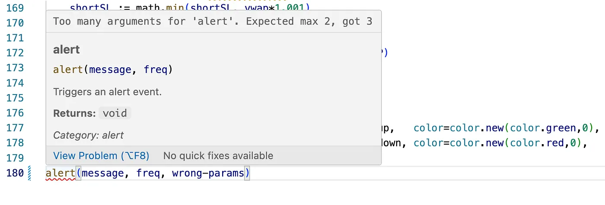
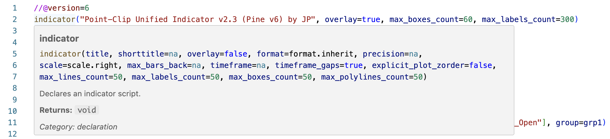

# Pine Script v6 IDE Tools

> **Professional Pine Script v6 development** in VS Code with IntelliSense, real-time validation, and 100% language coverage.

[](https://github.com/jpantsjoha/pinescript-vscode-extension/actions/workflows/ci.yml)
[](https://marketplace.visualstudio.com/items?itemName=jpantsjoha.pinescript-v6-extension)
[](https://marketplace.visualstudio.com/items?itemName=jpantsjoha.pinescript-v6-extension)
[](https://marketplace.visualstudio.com/items?itemName=jpantsjoha.pinescript-v6-extension)
[](./LICENSE)


*Real-time validation, IntelliSense, and hover documentation for Pine Script v6*


*Complete function signatures with parameter hints and documentation*

---

## 🚀 Quick Start

### Install from Marketplace
Search for **"Pine Script v6 IDE Tools"** in VS Code Extensions or [install directly from marketplace](https://marketplace.visualstudio.com/items?itemName=jpantsjoha.pinescript-v6-extension)

### Or Install from VSIX
Download the latest `.vsix` from [Releases](https://github.com/jpantsjoha/pinescript-vscode-extension/releases) and install:
```bash
code --install-extension pinescript-v6-extension-0.4.4.vsix
```

---

## ✨ Features

### 🎯 **100% Pine Script v6 Coverage**
- **6,665 language constructs** from official TradingView reference
- **457+ functions** with autocomplete (ta.*, math.*, str.*, array.*, etc.)
- **31 constant namespaces** (xloc, yloc, extend, scale, display, etc.)
- **22 function namespaces** with full parameter validation
- **32 strategy.* variables** (position_size, equity, netprofit, etc.)

### 🔍 **Real-Time Validation**
- Catches undefined functions and variables
- Detects missing/extra parameters
- Validates namespace properties
- **Zero false positives** on valid v6 code

### 💡 **Intelligent IntelliSense**
- Smart autocomplete for all built-in functions
- Parameter hints with type information
- Hover documentation
- Namespace-aware suggestions

### 📝 **Syntax Highlighting**
- Complete Pine Script v6 syntax support
- Built-in variables and constants
- Keywords, operators, and functions
- Comments and strings

---

## 📖 Usage Examples

### Valid Pine Script v6 Code

```pinescript
//@version=6
indicator("My Indicator", overlay=true)

// All valid v6 syntax - no false positives! ✅
length = input.int(14, "Length")
source = input.source(close, "Source")

// Technical analysis with autocomplete
sma_value = ta.sma(source, length)
ema_value = ta.ema(source, length)
rsi_value = ta.rsi(source, 14)

// Math functions with precision parameter
rounded = math.round(close, 2)  // ✅ v0.4.4+ supports precision
max_val = math.max(open, close)

// Strategy variables fully supported
if strategy.position_size > 0
    plot(strategy.equity, "Equity")
    plot(strategy.netprofit, "Net Profit")

// Plot with all v6 constants
plot(sma_value, "SMA", color=color.new(color.blue, 50), style=plot.style_line)
plot(ema_value, "EMA", color=color.new(color.red, 50), style=plot.style_linebr)

// All namespace constants work
x = xloc.bar_index
y = yloc.price
e = extend.both
s = scale.left
```

---

## 🔧 Configuration

The extension works out of the box with zero configuration. All Pine Script v6 features are automatically recognized.

---

## 📊 What's New in v0.4.4

### Fixed Parser Issues
- ✅ `math.round()` now correctly accepts optional `precision` parameter
- ✅ Added 32 missing `strategy.*` runtime variables
- ✅ Eliminates false positives for valid strategy scripts

### Before v0.4.4
```pinescript
rounded = math.round(close, 2)  // ❌ ERROR: Too many arguments
if strategy.position_size > 0   // ⚠️  WARNING: Unknown constant
```

### After v0.4.4
```pinescript
rounded = math.round(close, 2)  // ✅ Valid
if strategy.position_size > 0   // ✅ Valid
```

See [CHANGELOG](./CHANGELOG.md) for complete version history.

---

## 🧪 Testing

This extension is thoroughly tested:
- **67/67 unit tests passing** (100%)
- **7/8 example files validated**
- Parameter validation verified
- Namespace property detection tested

```bash
npm test  # Run test suite
```

---

## 🤝 Contributing

Contributions welcome! See [CONTRIBUTING.md](./CONTRIBUTING.md) for guidelines.

### Found a Bug?
- Check [existing issues](https://github.com/jpantsjoha/pinescript-vscode-extension/issues)
- Create a new issue with:
  - Pine Script code that triggers the problem
  - Expected vs actual behavior
  - Extension version

### Want to Help?
- Report false positives/negatives
- Suggest feature improvements
- Submit pull requests
- Share feedback

---

## 📚 Resources

- **Marketplace**: [Pine Script v6 IDE Tools](https://marketplace.visualstudio.com/items?itemName=jpantsjoha.pinescript-v6-extension)
- **Repository**: [GitHub](https://github.com/jpantsjoha/pinescript-vscode-extension)
- **Issues**: [Bug Reports](https://github.com/jpantsjoha/pinescript-vscode-extension/issues)
- **Releases**: [Changelog](https://github.com/jpantsjoha/pinescript-vscode-extension/releases)
- **Story**: [How This Extension Was Built](https://jaroslav-pantsjoha.medium.com/couldnt-find-a-pinescript-language-support-on-ide-so-i-built-one-enjoy-1fe57df0560f) (Medium)
- **TradingView Pine Script Reference**: [Official Docs](https://www.tradingview.com/pine-script-reference/v6/)

---

## 📄 License

MIT License - see [LICENSE](./LICENSE) for details.

---

## 🙏 Acknowledgments

Created by [Jaroslav Pantsjoha](https://github.com/jpantsjoha)

Special thanks to:
- TradingView for Pine Script
- VS Code extension development community
- All contributors and testers

---

**Full Language Coverage**: 6,665 Pine Script v6 constructs
**Test Coverage**: 67 comprehensive tests
**Current Version**: 0.4.4
