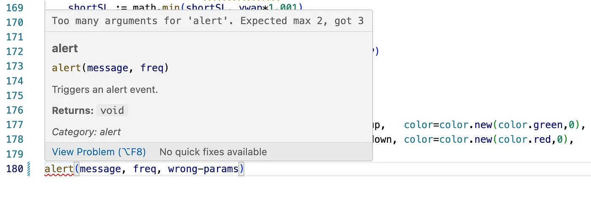
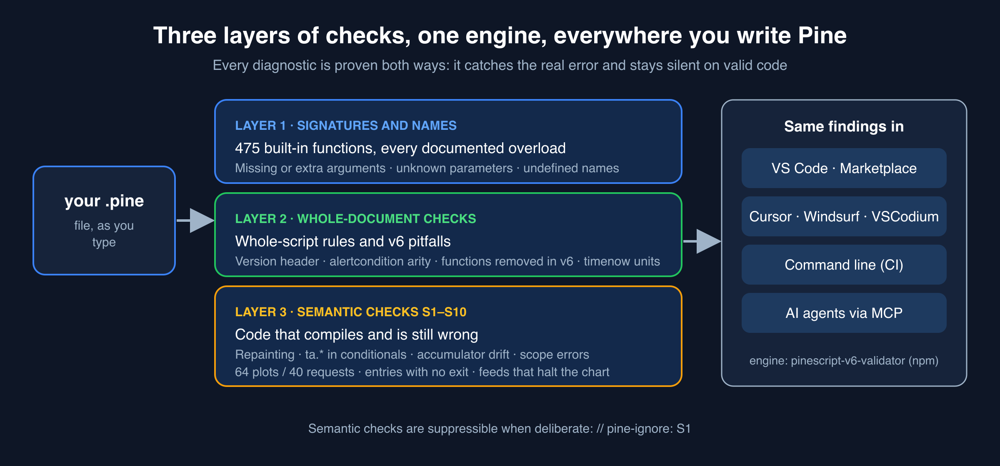
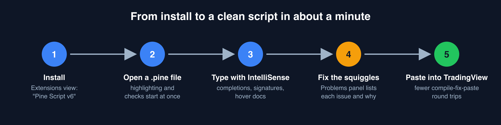
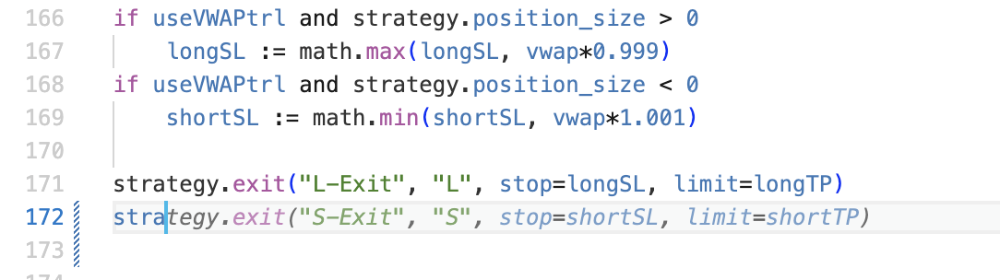
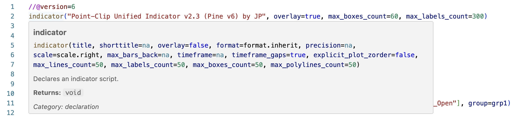

# Pine Script v6 IDE Tools

**Write TradingView Pine Script v6 in VS Code and catch mistakes before you paste into TradingView,
including the ones that compile and are still wrong.**

[](https://marketplace.visualstudio.com/items?itemName=jpantsjoha.pinescript-v6-extension)
[](https://marketplace.visualstudio.com/items?itemName=jpantsjoha.pinescript-v6-extension)
[](https://marketplace.visualstudio.com/items?itemName=jpantsjoha.pinescript-v6-extension)
[](https://open-vsx.org/extension/jpantsjoha/pinescript-v6-extension)
[](https://github.com/jpantsjoha/pinescript-vscode-extension/actions/workflows/ci.yml)
[](./LICENSE)

Built and maintained by **[Jaroslav Pantsjoha](https://jpantsjoha.com)**. Free, open source, and unofficial: not affiliated with TradingView.



---

## Why use it

TradingView's Pine Editor is the only place Pine Script compiles, so most authors find their
mistakes one paste at a time. This extension moves that feedback into your editor.

- **Fewer compile-fix-paste round trips.** Wrong argument counts, misspelled parameter
  names and undefined functions are underlined as you type.
- **Catches what TradingView does not.** Some scripts compile and still give wrong answers:
  a higher-timeframe request that repaints, a `ta.*` call that skips bars, an accumulator
  that grows forever. The semantic checks flag them, with the reason and the fix.
- **No noise on correct code.** Every check is tested in both directions: it must catch the
  real error and stay silent on valid code. A false positive is treated as a bug.
- **Works where you work.** VS Code, Cursor, Windsurf and VSCodium, plus a command-line
  checker and an MCP server for AI coding agents, all running the same engine.



---

## Get started



1. **Install.**
   - VS Code: search **"Pine Script v6 IDE Tools"** in the Extensions view, or
     [install from the Marketplace](https://marketplace.visualstudio.com/items?itemName=jpantsjoha.pinescript-v6-extension).
   - Cursor, Windsurf, VSCodium, Gitpod: install from
     [Open VSX](https://open-vsx.org/extension/jpantsjoha/pinescript-v6-extension).
   - Offline: download the `.vsix` from
     [Releases](https://github.com/jpantsjoha/pinescript-vscode-extension/releases) and run
     `code --install-extension pinescript-v6-extension-0.6.5.vsix`.
2. **Open or create a `.pine` file.** Highlighting and checks start immediately; there is
   nothing to configure.
3. **Paste this and watch the checks work:**

   ```pinescript
   //@version=6
   indicator("My first check", overlay=true)

   length = input.int(14, "Length", minval=1)
   fast = ta.ema(close, length)
   slow = ta.ema(close, length * 2)

   // Higher-timeframe data, read without repainting. Change close[1] to close and
   // delete the last two arguments: the repainting warning (S1) appears, with the fix.
   daily = request.security(syminfo.tickerid, "D", close[1], barmerge.gaps_off, barmerge.lookahead_off)

   plot(fast, "Fast", color=color.new(color.blue, 0))
   plot(slow, "Slow", color=color.new(color.orange, 0))
   plot(daily, "Prior daily close", color=color.gray, style=plot.style_stepline)
   ```

4. **Read the Problems panel** (`Ctrl+Shift+M` / `Cmd+Shift+M`). Each entry says what is
   wrong and why. Hover any built-in for its documentation.
5. **Paste into TradingView** with far fewer surprises.

---

## What it catches

**Before TradingView rejects it**

| Mistake | Example |
|---|---|
| Wrong number of arguments | `ta.sma(close)`: missing `length` |
| Misspelled constant | `color.purplee`, `xloc.bar_indexx` |
| Unknown parameter name | `plotshape(cond, shape=shape.circle)`: the parameter is `style=` |
| Undefined function or namespace | `ta.smaa(close, 14)`, `mylib.value` |
| Plot calls inside a block | `if cond` then `plot(x)`: plot at global scope with `na` instead |
| Platform limits | more than 64 plots or 40 `request.*()` calls |

**Compiles, but is wrong (semantic checks)**

| Check | What it means | Usual fix |
|---|---|---|
| **S1** Repainting | `request.security()` reads the still-forming higher-timeframe bar, so backtests look better than live | use `close[1]`, or state `barmerge.lookahead_off` |
| **S2** `ta.*` in a conditional | the function skips bars, so its history has gaps | compute it every bar, then use the result in the condition |
| **S3** Accumulator lifetime | a `var` total re-added every bar grows forever; a missing `var` resets every bar | reset before the loop, or add or remove `var` |
| **S7 / S8** Scope | `plot`, `bgcolor`, `barcolor` inside `if`; functions defined inside a block | move to global scope |
| **S9** Unbounded risk | `strategy.entry` with no exit anywhere | add `strategy.exit` or `strategy.close` |
| **S10** Unguarded external feed | a hard-coded `"FRED:…"` or `"ECONOMICS:…"` symbol halts the whole script with *Permission denied for symbol* on plans that cannot read it | pass `ignore_invalid_symbol=true` |

Made a deliberate choice? Silence one semantic check on one line: `// pine-ignore: S1`.
Compile errors cannot be silenced.

---

## Editing features

- **Completions, signature help and hover for all 475 built-in functions** in
  TradingView's v6 reference; signature help shows every documented overload. Type
  `ta.vwap(` and signature help lists each of its forms as you fill in the arguments.
- **Parameter names complete inside a call.** Type `plot(close, ` and the list offers
  `title=`, `color=`, `linewidth=` and the rest still unfilled; after `style=` it offers
  the constants that fit.
- **Constants and variables complete after a namespace dot.** Type `plot.`, `xloc.`,
  `shape.`, `location.`, `size.`, `display.`, `session.` or `strategy.commission.` and
  the list offers that namespace's members, each with its description on hover.
- **Misspelled constants and unknown namespaces are flagged.** `color.purplee` is
  underlined as an error, just as TradingView rejects it.
- **Quick fixes on the lightbulb** (Ctrl+. / Cmd+.) for problems the extension already
  reports: `color.purplee` becomes `color.purple` when exactly one documented name is
  close; `plotshape(shape=shape.circle)` becomes `style=`; a hard-coded external feed
  gets `ignore_invalid_symbol=true`; any semantic check can be silenced on its line with
  `// pine-ignore: S<n>`; a script with no version gets `//@version=6`. No action is
  offered when the right edit is not clear. A repainting `request.security` (S1) gets
  only the ignore action: whether `close[1]` with `lookahead_on` is correct depends on
  the chart timeframe and the expression, which the text cannot show.
- **Wrapped statements are read as one.** Split a call across lines and the argument
  checks still apply, and names declared on the wrapped lines stay defined.
- **Syntax highlighting** for v6, including `type`, `enum` and `method`.



The grey ghost text above comes from VS Code's AI inline suggestions (GitHub Copilot or
similar), not from this extension, which has no inline-completion feature. What the
extension adds in that picture is the Pine v6 syntax highlighting, and its checks run on
the finished line.



### Commands and settings

| Command (Command Palette) | Does |
|---|---|
| `Pine: Validate current file` | re-runs every check on the open file |
| `Pine: Show docs for symbol` | opens the documentation for the symbol under the cursor |

| Setting | Default | Does |
|---|---|---|
| `pine.docsMode` | `full` | `full` or `summary` documentation in hovers and completions |
| `pine.applyFileAssociation` | `true` | maps `*.pine` files to Pine Script on activation |
| `pine.httpSuggestions.enabled` | `false` | optional hook to an HTTP completion service you run yourself |

---

## Troubleshooting

- **Valid code is flagged.** That is a bug here, not in your script.
  [Open an issue](https://github.com/jpantsjoha/pinescript-vscode-extension/issues) with
  the smallest snippet that shows it; false positives are fixed first.
- **A warning is right, but intentional.** Add `// pine-ignore: S<n>` on that line.
- **The script compiles but TradingView says *Permission denied for symbol*.** Your plan
  cannot read that data feed. Pass `ignore_invalid_symbol=true` so the feed returns `na`
  instead of stopping the script (the S10 hint points at these calls).
- **No highlighting.** Check the language mode in the status bar reads *Pine Script*.

---

## For developers and AI agents

- **Command line:** `node validate-cli.js my-script.pine` runs the same checks as the
  editor and exits non-zero on errors, ready for CI.
- **Engine on npm:** [`pinescript-v6-validator`](https://www.npmjs.com/package/pinescript-v6-validator)
  is the validation engine on its own.
- **AI coding agents:** [pinescript-plugin](https://github.com/jpantsjoha/pinescript-plugin)
  gives agents Pine Script v6 skills and an MCP validation tool built on the same engine,
  so an agent and your editor never disagree about a file.
- **Contributing:** see [CONTRIBUTING](./docs/guides/CONTRIBUTING.md). Every fix ships with
  a test that proves it catches the real error and one that proves it stays quiet on
  valid code.

---

## What's new

**0.6.5**: the full v6 reference in IntelliSense, parameter-name completions inside
calls, constant completions after a namespace dot, misspelled-constant and
unknown-namespace errors, and checks that read wrapped statements as one.

**0.6.4**: current with TradingView's September 2026 Pine v6 reference
(`request.footprint()`, `footprint.*`, `volume_row.*`), every documented overload accepted,
`display` on every `input.*()`, and now on Open VSX.

**0.6.3**: fewer false positives (`request.security` lookahead, `timestamp()`, function
parameters), the S10 external-feed hint, `enum` highlighting.

Full history in the [CHANGELOG](./CHANGELOG.md). Plans in the [ROADMAP](./ROADMAP.md).

---

## About

Created by **[Jaroslav Pantsjoha](https://jpantsjoha.com)**, who could not find proper Pine
Script support for a real IDE and built it.
[Read the story](https://jaroslav-pantsjoha.medium.com/couldnt-find-a-pinescript-language-support-on-ide-so-i-built-one-enjoy-1fe57df0560f).

- Website: [jpantsjoha.com](https://jpantsjoha.com)
- GitHub: [@jpantsjoha](https://github.com/jpantsjoha)
- LinkedIn: [in/johas](https://uk.linkedin.com/in/johas)

If it saves you time, a [rating on the Marketplace](https://marketplace.visualstudio.com/items?itemName=jpantsjoha.pinescript-v6-extension&ssr=false#review-details)
helps other Pine authors find it.

**License:** MIT, see [LICENSE](./LICENSE). Pine Script and TradingView are trademarks of
TradingView, Inc.
